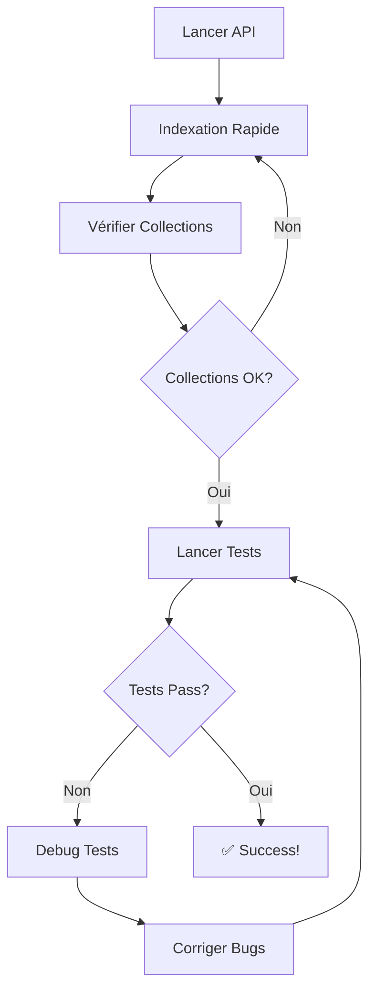

# Guide d'Indexation des PDF pour les Tests

**Date:** 2026-02-02

---

## 📋 Étapes pour Préparer les Tests

### 1. Lancer l'API

```bash
# Terminal 1 - Lancer l'API
uvicorn api.main:app --reload
```

Attendre que l'API soit prête (message "Application startup complete").

### 2. Indexer Rapidement des PDF

#### Option A: Indexation Rapide (3 PDF - 2-5 minutes)

```bash
# Terminal 2 - Indexation rapide
cd /Users/maximedutertre/Desktop/projet-perso/agent-business/RAG-system
python3 scripts/quick_index.py
```

Cette commande indexe 3 PDF légers:
- Hermès 2023
- LVMH 2024
- Safran 2024

**Temps estimé:** 2-5 minutes

#### Option B: Indexation Complète (75+ PDF - 2-4 heures)

```bash
# Terminal 2 - Indexation complète
python3 scripts/index_all_pdfs.py
```

Indexe TOUS les PDF du dossier `data/context/`.

**Temps estimé:** 2-4 heures ⚠️

---

### 3. Vérifier les Collections

```bash
curl http://localhost:8000/collections
```

Ou via un navigateur:
```
http://localhost:8000/docs
```

Puis testez l'endpoint GET `/collections`.

---

### 4. Lancer les Tests

```bash
# Terminal 2 - Tous les tests
./run_tests.sh

# OU seulement les tests RAG
./run_tests.sh rag

# OU seulement les tests d'intégration
./run_tests.sh integration
```

---

## 📊 Structure des Collections Créées

Après indexation rapide:
```
Collections:
├── Hermes_2023        (~50-100 chunks)
├── LVMH_2024          (~30-50 chunks)
└── Safran_2024        (~20-40 chunks)
```

Après indexation complète:
```
Collections: 75+ collections
├── LVMH_2023, LVMH_2024
├── Hermes_2024
├── TotalEnergies_2023, TotalEnergies_2024
├── Airbus_2023, Airbus_2024
├── BNP_Paribas_2023, BNP_Paribas_2024
├── AXA_2023, AXA_2024
├── Danone_2023, Danone_2024
├── Renault_2024, Renault_2025
├── Sanofi_2023, Sanofi_2024
├── Air_Liquide_2022, Air_Liquide_2023, Air_Liquide_2024
├── Schneider_Electric_2023, Schneider_Electric_2024
├── LOréal_2021, LOréal_2022, LOréal_2023
├── Orange_2023, Orange_2024
├── Capgemini_2023, Capgemini_2024
├── Kering_2023, Kering_2024
├── Pernod_Ricard_2024, Pernod_Ricard_2025
├── Engie_2023, Engie_N/A
├── Saint-Gobain_2024
├── Vinci_2023, Vinci_2024
├── Bouygues_2023, Bouygues_2025
├── Carrefour_2023, Carrefour_2024
├── Safran_2023, Safran_2024, Safran_2025
├── STMicroelectronics_2024, STMicroelectronics_2025
└── Dassault_Systèmes_2023, Dassault_Systèmes_2024
```

---

## 🧪 Tests qui Nécessitent des Collections

### Tests RAG (`test_rag_workflow.py`)

Ces tests seront **skipped** si aucune collection n'existe:

```python
@pytest.mark.rag
class TestRAGWorkflow:
    def test_semantic_search(self):
        # Nécessite au moins 1 collection
        ...

    def test_query_with_answer_generation(self):
        # Nécessite au moins 1 collection
        ...
```

### Tests d'Intégration (`test_integration.py`)

```python
@pytest.mark.integration
class TestEndToEndIntegration:
    def test_rag_to_agents_integration(self):
        # Nécessite au moins 1 collection
        # Skipped si collections vides
        ...

    def test_multi_source_data_integration(self):
        # Teste l'intégration RAG avec autres sources
        # Passe même sans collection (mais mieux avec)
        ...
```

---

## 🐛 Résolution des Problèmes d'Indexation

### Problème 1: API non accessible

```
❌ API non accessible
```

**Solution:**
```bash
# Vérifier si l'API tourne
curl http://localhost:8000/health

# Si pas de réponse, lancer l'API
uvicorn api.main:app --reload
```

---

### Problème 2: Timeout pendant l'indexation

```
❌ Exception: Request timeout
```

**Cause:** Fichier PDF trop volumineux (>20MB)

**Solutions:**
1. Augmenter le timeout dans le script:
   ```python
   timeout=600  # 10 minutes au lieu de 5
   ```

2. Indexer les gros fichiers séparément:
   ```bash
   # Indexer un seul fichier
   curl -X POST "http://localhost:8000/upload" \
     -F "file=@data/context/LVMH_Rapport_Annuel_2024_FR.pdf" \
     -F "collection_name=LVMH_2024" \
     -F "chunk_size=1000" \
     -F "chunk_overlap=200"
   ```

---

### Problème 3: Erreur "Collection already exists"

```
⏭️  Collection 'LVMH_2024' existe déjà
```

**C'est normal!** Le script skip automatiquement les collections existantes.

Pour ré-indexer:
1. Supprimer la collection:
   ```bash
   curl -X DELETE "http://localhost:8000/collection/LVMH_2024"
   ```

2. Ré-indexer:
   ```bash
   python3 scripts/quick_index.py
   ```

---

### Problème 4: Tests toujours skipped

Si après indexation les tests RAG sont toujours skipped:

**Vérifier:**
```bash
# Vérifier qu'il y a bien des collections
curl http://localhost:8000/collections

# Si vide, ré-indexer
python3 scripts/quick_index.py
```

**Vérifier que l'API utilisée par les tests est la bonne:**
```bash
# Dans tests/conftest.py, vérifier:
@pytest.fixture
def api_base_url():
    return "http://localhost:8000"  # Doit correspondre à votre API
```

---

## ⏱️ Temps d'Indexation Estimés

| Fichier | Taille | Temps |
|---------|--------|-------|
| Petit (<2MB) | 524KB - 1.8MB | 30s - 1min |
| Moyen (2-10MB) | 2MB - 10MB | 1-3min |
| Gros (10-20MB) | 10MB - 20MB | 3-5min |
| Très gros (>20MB) | 20MB+ | 5-10min |

**Total pour quick_index.py:** 2-5 minutes
**Total pour index_all_pdfs.py:** 2-4 heures

---

## 📈 Monitoring de l'Indexation

Pendant l'indexation, vous pouvez monitor:

### Terminal 1 - Logs API
```bash
# Voir les logs de l'API
# (déjà visible dans le terminal où tourne uvicorn)
```

### Terminal 2 - Script d'indexation
```bash
# Voir la progression
python3 scripts/quick_index.py
```

### Terminal 3 - Vérifier les collections
```bash
# Pendant l'indexation, dans un 3ème terminal:
watch -n 5 'curl -s http://localhost:8000/collections | python3 -m json.tool'
```

---

## 🎯 Workflow Recommandé



### Commandes Complètes

```bash
# 1. Lancer l'API (Terminal 1)
uvicorn api.main:app --reload

# 2. Indexer (Terminal 2)
python3 scripts/quick_index.py

# 3. Vérifier
curl http://localhost:8000/collections

# 4. Lancer tests
./run_tests.sh

# 5. Si tests échouent, debug
pytest tests/test_rag_workflow.py -v -s
```

---

## 💡 Astuces

### Indexation Plus Rapide

Pour indexer plus rapidement (au détriment de la qualité):

```python
# Dans quick_index.py ou index_all_pdfs.py
data = {
    'collection_name': collection_name,
    'chunk_size': 2000,      # ⬆️ Augmenter (moins de chunks)
    'chunk_overlap': 100,    # ⬇️ Diminuer
}
```

### Indexer Seulement Certains PDF

Modifier `quick_index.py`:

```python
pdfs_to_index = [
    ("votre_pdf1.pdf", "Collection1"),
    ("votre_pdf2.pdf", "Collection2"),
]
```

### Tester Sans Indexer

Certains tests peuvent tourner sans collections:

```bash
# Tests qui ne nécessitent pas de RAG
./run_tests.sh portfolio
./run_tests.sh financial

# Tests rapides seulement
./run_tests.sh quick
```

---

## 📝 Résumé

1. **Avant les tests:** `python3 scripts/quick_index.py`
2. **Lancer tests:** `./run_tests.sh`
3. **Si skip RAG:** Vérifier que collections existent
4. **Pour tout indexer:** `python3 scripts/index_all_pdfs.py` (long!)

---

**Prêt à tester?** 🚀

```bash
# GO!
uvicorn api.main:app --reload &
sleep 5
python3 scripts/quick_index.py
./run_tests.sh
```
